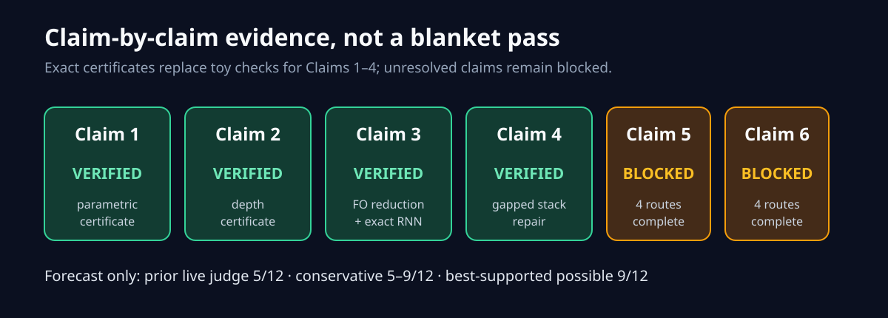
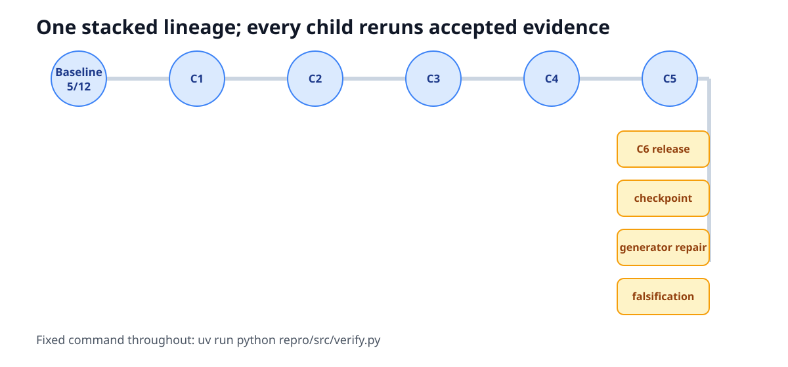

# Why are linear RNNs more parallelizable? An exact-evidence reproduction



The paper asks whether the sequential-looking recurrence in an RNN is actually
the reason it is hard to parallelize. Its answer is more subtle: linear
recurrences can be reorganized as balanced arithmetic circuits, while
nonlinear recurrence can encode computations believed to resist shallow
parallel circuits. We audited that answer claim by claim on CPU, replacing the
previous five toy checks with exact certificates where possible and refusing
to award ourselves a pass where the public evidence is incomplete.

Previous live judged score: **5/12**. The conservative post-publication forecast
is **5–9/12**; the best-supported possible score is **9/12**. Those are
forecasts, not a new judge result.

## What the implementation proves

The fixed command is:

```bash
uv run python repro/src/verify.py
```

It uses Python 3.12, a committed `uv.lock`, and CPU-only PyTorch 2.8.0. Each
experiment node inherits this exact command. Scientific variation lives only in
committed verifier code and claim contracts.

The core implementation path is intentionally small:

1. each `claim*_proof.py` loads an exact, source-anchored contract;
2. it verifies a symbolic or parametric certificate and its resource bound;
3. a structurally independent checker catches implementation errors;
4. a negative control must fail for the intended reason;
5. the cumulative driver reports `VERIFIED`, `FALSIFIED`, or `BLOCKED`.



| Claim | Paper statement under test | Evidence | Result |
| --- | --- | --- | --- |
| 1 | Rational LRNN languages lie in PNC¹ | Affine-composition identity and balanced resource induction | VERIFIED |
| 2 | Boolean depth is \(O(\log n\log^*n)\) | Corrected Q-to-Z lift plus Jung simulation composition | VERIFIED |
| 3 | Log-precision nonlinear RNN solves L-complete sorted connectivity | FO layering reduction and exact counter-RNN certificate | VERIFIED |
| 4 | A poly-precision nonlinear RNN recognizes a P-complete language | Gapped base-4 stack and padded simulation | VERIFIED |
| 5 | Four-layer RWKV-7 and DeltaNet solve iterated 3×3 products | Four routes; DeltaNet router obstruction unresolved existential | BLOCKED |
| 6 | Only nonlinear RNN generalizes well in Figure 2 DGC | Four release, checkpoint, sensitivity, and falsification routes | BLOCKED |

### Claims 1–2: balancing the linear recurrence

An affine recurrent step is represented by `(A, b)`. Composition is

```text
(A, b) ∘ (C, d) = (AC, bC + d).
```

The verifier normalizes both parenthesizations as formal noncommutative
polynomials. A balanced tree over `n` steps has
`ceil(log2(n))` composition depth and `n-1` internal nodes. That is the
universal mechanism behind Claim 1, rather than a finite equality test.

Claim 2 composes that result with the audited arithmetic-to-Boolean simulation.
The paper prints the rational addition denominator as `bc`; the correct value
is `bd`. The negative control evaluates `1/2 + 1/3`: the printed formula gives
`5/2`, while exact addition gives `5/6`. The certificate rejects the typo and
checks the corrected construction.

### Claims 3–4: nonlinear state and exact discrete computation

Claim 3 layers a functional graph into a forward-sorted deterministic graph.
A one-pass counter follows the unique path. Its exact integer zero bit is

```text
zero(z) = ReLU(1 - (ReLU(z) + ReLU(-z))).
```

The certificate retains the paper’s crucial conditional qualifier: the
\(\Omega(\log^2 n)\) consequence depends on the stated L-versus-shallow-circuit
conjecture. The independent checker exhausts 205,012 complete finite-domain
instances and 8,193 integer zero-mask inputs.

For Claim 4, the paper’s base-2 stack has a vanishing classification margin, so
we reject that proof. A corrected exact base-4 encoding has a fixed gap:

```text
E(empty)=0
E(bw)=(2b+1+E(w))/4
top 0 in [1/4,1/2), top 1 in [3/4,1).
```

Fixed ReLU observers implement head, nonempty, push, and pop exactly. Bit
complexity grows linearly with the number of stack operations, and polynomial
padding supplies one recurrent clock symbol per simulated transition. This
repairs the existential claim without pretending the defective source formula
was correct.

## Claim 5: arithmetic works, the exact router does not

The RWKV-7 overwrite compiler works after using the architecture’s BOS token to
initialize state. The DeltaNet arithmetic compiler also works: it builds exact
rational transvections and a 694-step program per matrix.

The published two-dimensional rational Householder router, however, needs
period 1,404. A rational 2×2 matrix cannot contain a primitive 1,404th root of
unity because

```text
phi(1404) = 432 > 2.
```

This invalidates a necessary published lemma. It does not prove that no other
four-layer DeltaNet exists, so four distinct routes—including a dedicated
falsification route—end at `BLOCKED`.

## Claim 6: the released empirical artifact is not Figure 2


The author release contains one DGC checkpoint. Its tensor names identify a
one-layer self-attention model with no RNN tensors. An optimized exact
last-query evaluator was cross-checked against a separate quadratic
self-attention implementation to `2.98e-8` maximum logit difference. Across
all 90,000 validation examples, its accuracy is near chance and differs from
the Figure 2 Transformer row by 11.26–43.08 percentage points.

This is substantial divergence, but it is not a valid falsification. The
release does not say that this weight file produced Figure 2, and its launcher
does not match either paper protocol.

### A perfect endpoint shortcut

The released generator initializes every interior bucket entry to zero, then
samples an entry only if it is neither zero nor one. That sampling branch is
unreachable. Across all 190,000 released examples, the label equals the simple
rule “there is an edge out of the source and an edge into the target” with
100% accuracy.

We repaired only the sentinel by starting interior entries as unassigned. Over
270,000 examples—three probabilities, three deterministic seeds, and three
length bins—every label still matched independent graph reachability. The
endpoint shortcut fell to 50.00–54.83%.


This diagnosis matters because the released benchmark does not isolate the
L-complete reachability mechanism. It still does not tell us what feature each
Figure 2 network learned.

### Why the fourth route remains blocked


A result qualifies as a Figure 2 counterexample only if dataset, model row,
Figure checkpoint, training protocol, and stochastic-run identity all hold.
The immutable inventory finds 170 tree entries, 152 blobs, two commits, one
DGC checkpoint, no dependency lock, and no DGC Mamba launcher.

The main text says batch 64 and learning rate `1e-4`; the appendix says batch
128 and `3e-4`. Both say 60,000 steps. Released launch paths use model-specific
settings and cap at 30,000 steps. The three available counterevidence routes
each fail at least one identity, while a fully identified checker control is
accepted. The mandatory falsification route therefore reports
`did_not_falsify`, and Claim 6 remains `BLOCKED`.

## Compute, limitations, and assessment

All formal runs used Hugging Face `cpu-upgrade`; no GPU was used. Before each
run we recorded an estimated useful core count. The terminal Claim 6 run
estimated 64 cores, exposed 64 logical and 64 affinity CPUs, spent 262.848
seconds inside the verifier, and completed in 291 seconds. Successful formal
runs through that point used 982 seconds of aggregate job wall time. Hugging
Face did not expose a monetary charge through `orx`, so monetary cost is
reported as unavailable rather than guessed.

Claims 1–4 are strongest where the reconstruction is parametric and
machine-checkable. They still trust explicitly named foundational theorems
rather than re-formalizing all of complexity theory. Claims 5–6 are valuable
negative results about the published proof and release, but neither crosses the
standard for `FALSIFIED`.

The winning scientific lineage ends at
[`orx/c6-exact-assumption-falsification-qualification`](https://github.com/MachineLearning-Nerd/icml26-repro-29sn1uqWn3-linear-rnn-parallelism/tree/orx/c6-exact-assumption-falsification-qualification).
The publication candidate descends from it without changing the scientific
method. The live judge alone can change the score.
